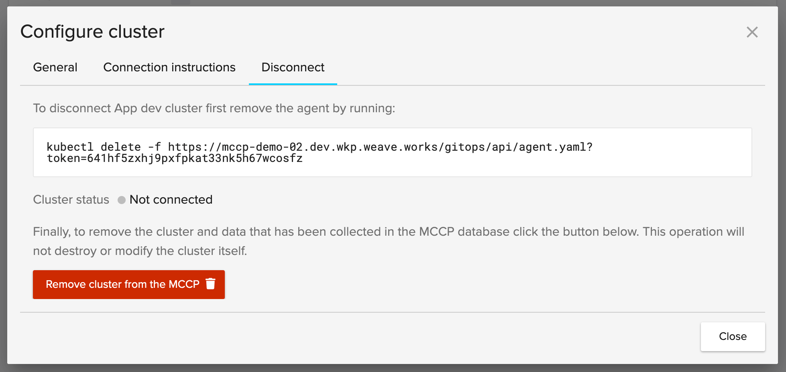

## How to: Enable the MCCP feature

Enabling the MCCP requires we:

1. Choose and configure the database in `config.yaml`
2. Enable the `fleetManagement` feature in `config.yaml`
3. Configure the ingress address for NATS that an agent running on a leaf cluster will connect to.

### 1. Choosing a database

The default MCCP database configuration will use **SQLite** on a _Host Volume_. For all the MCCP pods to be able to access this host volume they must be on the same node. We can do this by applying a label to one of the cluster worker nodes:

```
# list all worker nodes
$ kubectl get node --selector='!node-role.kubernetes.io/master' -o name
node/ip-192-168-40-197.eu-north-1.compute.internal
node/ip-192-168-68-212.eu-north-1.compute.internal

# choose the first one and label it for mccp database hosting
$ kubectl label node/ip-192-168-40-197.eu-north-1.compute.internal wkp-database-volume-node=true
```

Now you can enable the MCCP in config.yaml.

:::info
_The MCCP also supports **PostgreSQL** or mounting SQLite on Persistent Volume instead of the host volume described here. See [Database Configuration](./database-configuration) for details._
:::

### 2. Enable the MCCP in config.yaml

To enable the MCCP feature edit the `setup/config.yaml` file, set the `enabledFeatures: fleetManagement`
field to `true`, commit and push to the cluster repository.

After a few seconds, the MCCP components are deployed in the `wkp-gitops-repo-broker` namespace.

### 3. Set the ingress address for NATS

When connecting a leaf cluster a set of manifests are applied to with `kubectl apply -f https://wkp-host/gitops/api/agent.yaml?token=abc`. We set the NATS url that is included in `agent.yaml` (that the agent will use to connect to the management cluster) by editing `./cluster/platform/components.js`.

Once the MCCP has started up you'll see a NATS `NodePort` service running the in `wkp-gitops-repo-broker` namespace:

```
$ kubectl get services -n wkp-gitops-repo-broker nats-client
NAME          TYPE       CLUSTER-IP      EXTERNAL-IP   PORT(S)          AGE
nats-client   NodePort   10.100.14.240   <none>        4222:32545/TCP   20d
```

Take the port (in this case 32545) and update the `wkpGitopsRepoBroker` params with the _external address_ of the host (this can be an IP or a hostname) and port discovered above.

```javascript
const wkpGitopsRepoBroker = {
  // ...
  params: {
    // ...
    agentTemplate: {
      natsURL: '123.123.123.123:32454',
      // Could also be a hostname
      // "natsURL": "wkp-host:32454",
    },
    // ...
  },
  // ...
};
```

Commit and push the changes to `./cluster/platform/components.js`. You can now open the UI via configured ingress or with `wk ui` and connect clusters. See [How to connect a cluster](#how-to-connect-a-cluster) below.

_Tip: You can verify that the address is externally accessible with the [`natscli`](https://github.com/nats-io/natscli):_

```bash
# Wrong host/port will give a connection error
$ nats sub test --server wkp-host:1234
nats: error: nats: no servers available for connection, try --help

# Correct host/port will give an auth error!
# (This is fine we are not providing credentials here just testing the connection)
$ nats sub test --server wkp-host:32545
nats: error: nats: Authorization Violation, try --help
```

### Adding an ingress exception for `/agent.yaml`

If you have configured ingress with authentication (see [Securing the UI](../cluster-operations/auth) you may need to add an additional ingress rule for `/gitops/api/agent.yaml` to ensure that this path is publicly accessible. The manifest below shows how to add this rule.

```yaml
---
apiVersion: networking.k8s.io/v1beta1
kind: Ingress
metadata:
  annotations:
    kubernetes.io/ingress.class: nginx
    cert-manager.io/cluster-issuer: letsencrypt-prod
  name: wkp-ui-agent-no-auth
  namespace: wkp-ui
spec:
  rules:
    - host: <hostname-to-use> # e.g. app.wkp.weave.works
      http:
        paths:
          - path: /gitops/api/agent.yaml
            backend:
              serviceName: wkp-ui-nginx-ingress-controller
              servicePort: 80
  tls:
    - hosts:
        - <hostname-to-use> # e.g. app.wkp.weave.works
      secretName: wkp-tls
```

## How to: Connect a cluster {#how-to-connect-a-cluster}

To connect a cluster to the multi-cluster control plane (MCCP), first navigate to the `Clusters` section of the WKP UI and click on the `Connect a cluster` button. You will then be presented with a form to add the details of the leaf cluster being connected.

- Name: this is the name of the leaf cluster. This is a required field.
- Ingress URL: this is the publicly accessible HTTP(S) endpoint of the leaf cluster. This is an optional field.

Click on the `Save & next` button to persist these details. You will then be presented with a `kubectl` command that you can run to install an agent on your leaf cluster. The agent is responsible for inspecting the leaf cluster and sending back leaf information to the MCCP server. It will not make any changes to your cluster.

Ensure that your current kubeconfig context is setup to use the leaf cluster. Then copy the command and run it.

After a few seconds, the status of your cluster should change to `Connected (Ready)` which indicates that the leaf cluster has been successfully connected.

## How to: Update a cluster

To update a cluster, click on the rightmost icon of that cluster's row. You will be presented with a form that allows you to update its name and ingress URL. Finally click on the `Save & next` button to persist these changes.

## How to: Disconnect and remove a cluster

To disconnect a cluster open the config dialog with the 🛠 button on the cluster's row.

The _Disconnect_ tab shows instructions on how to remove the wkp-agent from your leaf cluster.

Once the agent has been removed its status will change from "Connected" to _Last seen_. Click _Remove cluster from the MCCP_ to remove the cluster and the meta-data that's been collected.

To re-connect the cluster again follow the _Connect a cluster_ instructions above.

